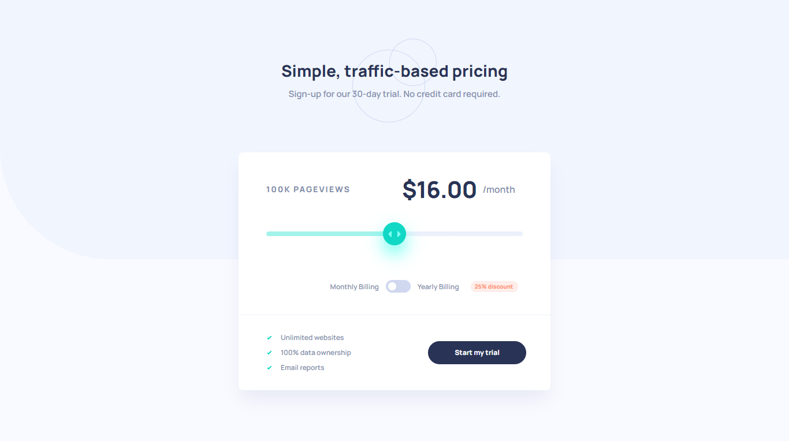

# Frontend Mentor - Interactive pricing component solution

This is a solution to the [Interactive pricing component challenge on Frontend Mentor](https://www.frontendmentor.io/challenges/interactive-pricing-component-t0m8PIyY8). Frontend Mentor challenges help you improve your coding skills by building realistic projects. 

## Table of contents

- [Overview](#overview)
  - [The challenge](#the-challenge)
  - [Screenshot](#screenshot)
  - [Links](#links)
- [My process](#my-process)
  - [Built with](#built-with)
  - [What I learned](#what-i-learned)
  - [Continued development](#continued-development)
  - [Useful resources](#useful-resources)
- [Author](#author)

## Overview

### The challenge

Users should be able to:

- View the optimal layout for the app depending on their device's screen size
- See hover states for all interactive elements on the page
- Use the slider and toggle to see prices for different page view numbers

### Screenshot

### Links

- Solution URL: [Github](https://github.com/jpdrsanchez/interactive-princing-component)
- Live Site URL: [Vercel](https://interactive-princing-component-henna.vercel.app/)

## My process

### Built with

- Semantic HTML5 markup
- CSS custom properties
- Flexbox
- CSS Grid
- Mobile-first workflow
- [React](https://reactjs.org/) - JS library
- [Next.js](https://nextjs.org/) - React framework
- [Styled Components](https://styled-components.com/) - For styles

### What I learned

With this challenge I was able to learn a lot about the use of the NextJS Framework and about server-side rendering, it was a great learning experience and I feel prepared to carry out other projects with nextJS. 💻💥

### Continued development

For my future projects I want to continue focusing in:

- NextJS
- SSR (Server Side Rendering)
- SSG (Static Site Generation)
- Deploy on other platforms like DigitalOcean

### Useful resources

- [NextJS Docs](https://nextjs.org/docs/getting-started) - NextJS Documentation.

## Author

- Website - [João Pedro Sanchez](https://jpdrsanchez.github.io/)
- Frontend Mentor - [@jpdrsanchez](https://www.frontendmentor.io/profile/jpdrsanchez)
